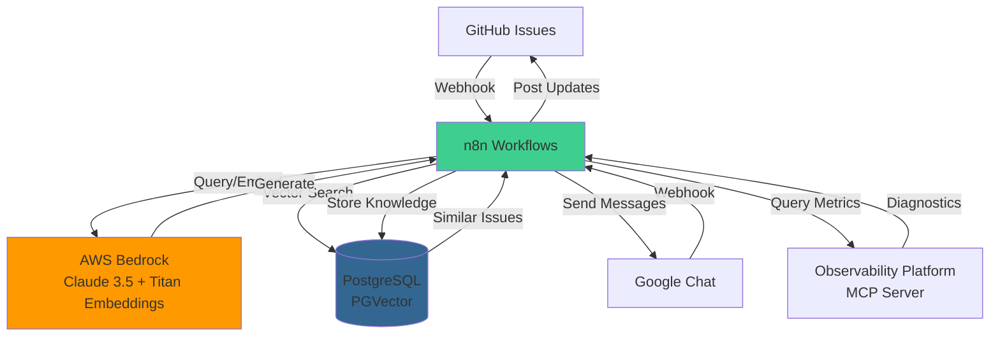
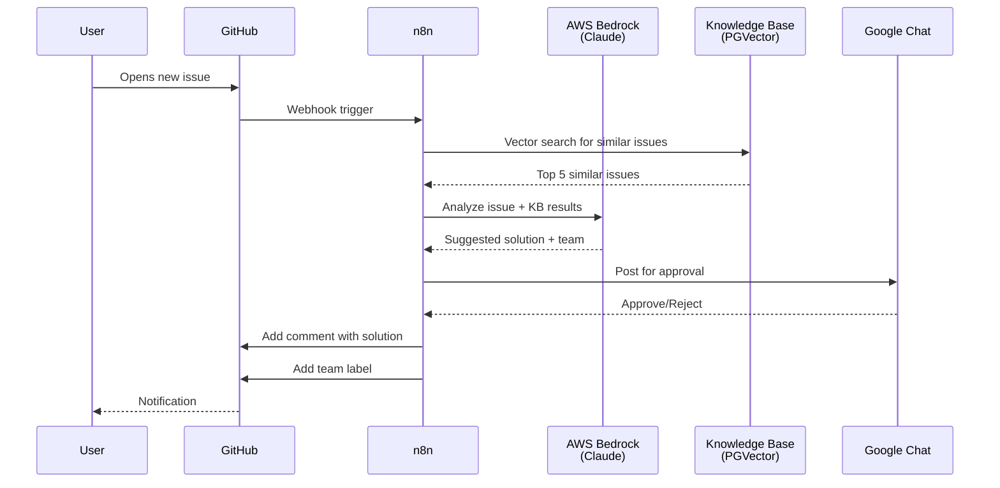
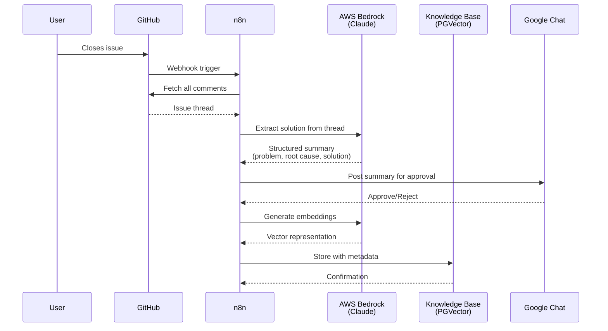
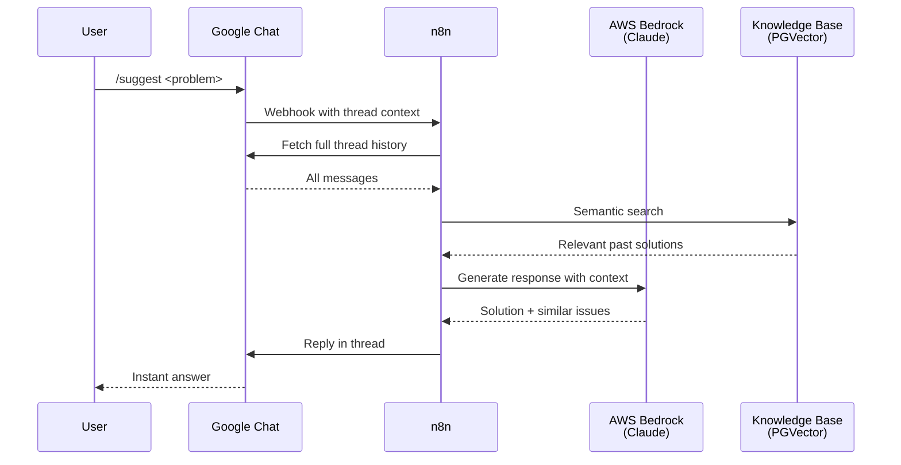

Our team handles platform and infrastructure support through a GitHub repository. For a while, support was purely reactive: an issue arrives, someone reads it, figures out who should own it, and eventually resolves it. The resolution stays buried in the ticket. Three months later, someone opens an almost identical issue.

This is a solvable problem if you treat every resolved ticket as training data.

## What we built

Two n8n workflows that work together:

The first watches the GitHub repository and handles issues throughout their lifecycle. When a new issue is opened, it searches a vector knowledge base for similar past issues, generates a suggested solution using Claude, routes to the right team based on content analysis, and posts a summary to Google Chat for human review before anything is posted publicly. When an issue is closed, it reads the entire thread, extracts the actual working solution (ignoring the failed attempts), generates structured embeddings, and stores everything in PostgreSQL with PGVector.

The second workflow is a Google Chat bot with a few commands. `/suggest` takes the current thread context, searches the knowledge base semantically, and replies with relevant past solutions. `/save` lets engineers manually add solutions — useful for tribal knowledge that never made it into a ticket. `/troubleshoot <app_name>` connects to our observability platform via MCP and does a tiered diagnostic: synthetic metrics first (fast, pre-aggregated), then raw spans only if errors are detected.

## Architecture



The AI layer uses Claude 3.5 Sonnet via AWS Bedrock for reasoning and Amazon Titan Embed v2 for vector representations. All knowledge base entries use JSON schema validation for structured output — early versions used free-form responses and were inconsistent enough to be useless for search.

PostgreSQL with PGVector handles cosine similarity search. Each stored vector includes the issue number, URL, solution, owning team, and root cause analysis as metadata. The metadata matters more than it sounds — it enables filtering by team, by error type, by recurrence.

## The flows

### New issue triage



### Knowledge capture on close



### Chat bot



## The prompts

Most of the quality of this system comes from the prompt engineering. The full prompts are worth sharing:

### Knowledge base extraction (closed issues)

```
You are a Principal Site Reliability Engineer (SRE) creating a "Knowledge Base"
entry from a raw GitHub Issue.

### INPUT DATA:
I will provide you with the Issue Title, Description, and the entire Comment History.

### YOUR GOAL:
Synthesize a technical "Root Cause & Solution" document. The output must be
specific enough that another engineer could copy-paste the solution to fix the
same error without reading the original thread.

### STRICT ANALYSIS RULES:
1. **Prioritize Code & Logs:** If the text contains error logs, stack traces,
   or configuration snippets (YAML/JSON), these are the most important parts.
   You MUST preserve specific error codes (e.g., "Exit Code 137", "OOMKilled").

2. **Find the "Turning Point":** Look for the comment where the user confirms
   the fix (e.g., "That worked!", "Merged PR #123"). The solution is likely
   in the comment *immediately preceding* this confirmation.

3. **Ignore Abandoned Paths:** If the users discussed 3 potential fixes but
   only the 3rd one worked, completely ignore the first two. Do not mention
   "We tried X and Y first." Only report the final working solution.

### OUTPUT FORMAT:
Extract these technical details into the JSON structure provided:
- problem: Summary of the user's original issue
- root_cause: What actually caused it
- solution: Step-by-step fix or code snippet
- error_messages: Specific error logs mentioned
- owning_team: The team responsible based on content analysis
```

### Solution suggestion (new issues)

```
You are a Senior Site Reliability Engineer (SRE) acting as a Tier 2 Support
specialist. Your goal is to provide immediate, actionable solutions to
infrastructure and platform issues based on the Technical Knowledge Base (KB)
available to you via your tools.

### OPERATIONAL GUIDELINES:
1. **Tool Usage**: Use the 'Postgres PGVector Store' tool to search for past
   resolutions. Search using technical keywords from the user's issue (e.g.,
   specific error codes, service names, or labels).

2. **Prioritize Precision**: If the KB entry contains specific error codes
   (e.g., "Exit Code 137"), YAML snippets, or CLI commands, include them
   exactly as they appear.

3. **No Fluff**: Do not use empathetic fillers like "I'm sorry you're having
   this issue." Start immediately with the solution or the root cause analysis.

4. **Final Working Fix Only**: Do not mention "trial and error" or paths that
   didn't work. Provide only the confirmed solution.

5. **Team Mapping**: Based on the content and the 'owning_team' found in the
   KB, you must classify the response into one of the allowed team categories.

### RESPONSE FORMAT:
Your final response must follow the structure required by the Output Parser:
1. **solution**: A clear, technical explanation of the fix.
2. **similar_issues**: Extract the 'issue_number' from the metadata of the
   items retrieved from the vector store.
3. **owning_team**: The team from the list above.

If no recorded solution is found in the Knowledge Base after searching, set
the solution to "No recorded solution found in the Knowledge Base. Please
escalate to the relevant domain team." and set the owning_team to "Unknown".
```

### Real-time troubleshooting

```
### High-Speed Troubleshooting Specialist

**Core Directive:** Prioritize **Time-to-Insight**. Do not request broad
datasets. Use a "tiered retrieval" strategy to provide the user with an
answer in the shortest possible time.

Use a small time window, e.g., the last hour.

### Optimized Workflow:

#### Phase A: The 5-Minute Pulse (Latency: ~500ms)
- Query **Synthetic Metrics** (not raw spans) for the last **5 minutes**.
- Goal: Identify if there is a spike in `error_count` or `p99_latency`.
- Logic: If metrics are healthy, report "No immediate issues in the last
  5 minutes" and ask if the user wants to look further back.

#### Phase B: Targeted Error Extraction (Latency: ~1-2s)
- If Phase A shows errors, request **only the 5 most recent spans** where
  `error=true`.
- Constraint: Do **not** request all span attributes. Request only: `span.id`,
  `service.name`, `exception.message`, and `http.status_code`.

#### Phase C: Root Cause Synthesis
- Based on those 5 spans, identify the common denominator (e.g., all failing
  spans point to the same `db.system`).

### Speed-Oriented Response Guidelines:
- **Summarize, Don't List:** Do not print a list of 10 spans. Say: "Found 42
  errors in the last 5 mins; the primary cause is a `500 Internal Server Error`
  on the `/auth` endpoint."
- **Be Succinct:** Use bullet points. Avoid conversational filler.
- **Early Exit:** If the application name is not found in the first tool call,
  stop and ask for clarification immediately.

### Safety & Performance Constraints:
- **Max Time Window:** Never default to a window larger than **15 minutes**
  unless explicitly asked.
- **Payload Limit:** Limit tool output to the top 10 results.
```

A few principles that made the prompts work: giving the AI a specific role, explicit rules about what to exclude (failed attempts, empathetic filler), structured output format, and clear failure handling. The "No Fluff" rule in particular made a significant difference to output quality.

## What actually changed

Triage time is down roughly 60%. Common issues now get answered without involving an engineer. The knowledge base has started surfacing patterns — clusters of similar issues that pointed to underlying infrastructure problems we were treating as one-offs. That last part was the most useful thing the system revealed.

The whole thing runs on infrastructure we already had: AWS Bedrock, PostgreSQL, GitHub, Google Chat. No custom application code. n8n handles the orchestration with visual workflows that were easy to iterate on as we learned what worked.

One thing we'd do differently: we initially tried fully automated responses without a human approval step. The approval gate in Google Chat was not bureaucracy — it caught real mistakes early enough that they didn't matter.

## What's next

A few things we're planning to add: proactive issue detection from metrics (create a ticket when an anomaly is detected, before anyone opens one manually), solution validation to track whether suggested resolutions actually worked, and multi-repo support. The current system only covers our main support tracker.
