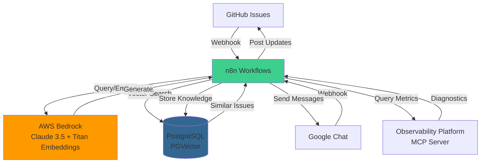
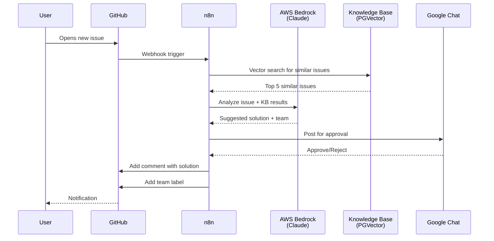
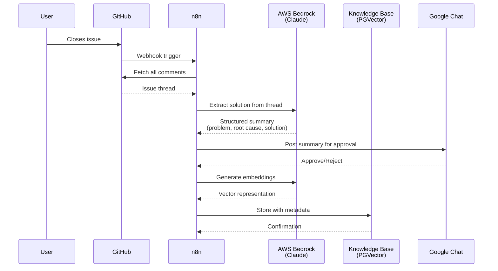
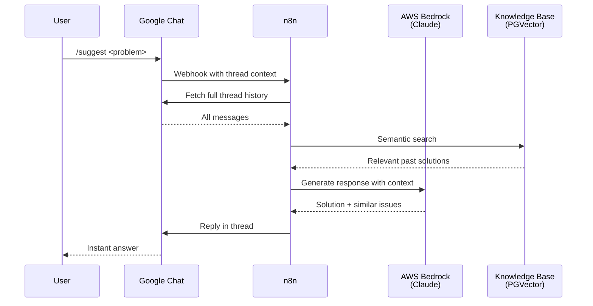

# Building an AI-Powered Support Automation System with n8n

Support tickets are the heartbeat of any engineering organization. They reveal recurring issues, knowledge gaps, and opportunities for improvement. But they also represent a significant operational burden—triaging, routing, resolving, and documenting solutions across hundreds or thousands of tickets.

What if your support system could learn from every resolved ticket and automatically suggest solutions to new issues? That's exactly what we built using n8n, Claude AI, and vector embeddings.

## The Problem

Our team manages infrastructure and platform support through a centralized GitHub repository. We were facing several challenges:

- **Manual Triage**: Every new issue required someone to read it, understand the context, and assign it to the right team
- **Lost Knowledge**: Once an issue was resolved, the solution often stayed buried in that specific ticket thread
- **Repeated Questions**: Users kept opening tickets for problems we'd already solved
- **Slow Response Times**: Our support engineers spent hours searching through old tickets to find similar issues

We needed a system that could automatically learn from resolved tickets and provide instant, context-aware assistance for new ones.

## The Solution: A Two-Part Automation System

We built two interconnected n8n workflows that work together to create a self-learning support system:

### 1. GitHub Issue Automation Workflow

This workflow monitors our GitHub support repository and handles issues throughout their lifecycle:

**When a new issue is opened:**
1. **AI Analysis**: Claude 3.5 Sonnet analyzes the issue content
2. **Knowledge Base Search**: Uses vector similarity search to find related past issues
3. **Solution Suggestion**: Generates a suggested solution based on historical resolutions
4. **Team Assignment**: Automatically determines which team should own the issue based on content analysis
5. **Human Approval**: Posts to Google Chat for team review before taking action
6. **GitHub Comment**: Adds an AI-generated comment with the suggested solution and similar past issues

**When an issue is closed:**
1. **Thread Analysis**: Reads the entire issue thread including all comments
2. **Solution Extraction**: Identifies the actual working solution (ignoring failed attempts)
3. **Structured Summarization**: Creates a knowledge base entry with:
   - Problem statement
   - Root cause analysis
   - Step-by-step solution
   - Error messages and logs
   - Owning team
4. **Vector Embedding**: Converts the summary to embeddings using AWS Bedrock Titan
5. **Knowledge Storage**: Saves to PostgreSQL with PGVector for semantic search

### 2. Google Chat Bot Workflow

This workflow provides our team with instant access to the knowledge base through conversational commands:

**`/suggest` command:**
- Reads the entire chat thread context
- Queries the knowledge base for similar issues
- Suggests solutions with references to past tickets
- Responds in the same thread

**`/save` command:**
- Allows manual addition of solutions to the knowledge base
- Useful for documenting tribal knowledge

**`/troubleshoot <application_name>` command:**
- Integrates with our observability platform via MCP protocol
- Performs real-time diagnostics:
  - Checks synthetic metrics for the last 5 minutes
  - Identifies error spikes and latency issues
  - Extracts the 5 most recent error spans
  - Synthesizes root cause analysis
- Optimized for speed with targeted queries and small time windows

## Technical Architecture

### System Overview



### AI Layer
- **LLM**: Claude 3.5 Sonnet via AWS Bedrock for reasoning and synthesis
- **Embeddings**: Amazon Titan Embed v2 for vector representations
- **Structured Output**: JSON schema validation ensures consistent knowledge base entries

### Data Layer
- **Vector Database**: PostgreSQL with PGVector extension
- **Semantic Search**: Cosine similarity search with top-K retrieval
- **Metadata**: Each vector stores issue number, URL, solution, team, and root cause

### Integration Layer
- **GitHub API**: Webhooks for issue events, REST API for comments and labels
- **Google Chat API**: Webhook triggers and message posting
- **Observability MCP**: Model Context Protocol client for metrics and traces

### Orchestration
- **n8n**: Visual workflow automation connecting all components
- **Conditional Logic**: Switch nodes route different issue actions
- **Human-in-the-Loop**: Approval gates for AI-generated content

## Workflow Diagrams

### New Issue Flow: AI-Powered Triage



### Closed Issue Flow: Knowledge Capture



### Chat Bot Flow: Instant Support



## Key Features

### 1. Intelligent Team Routing

The AI analyzes issue content and maps it to the appropriate engineering team based on the domain (infrastructure, platform, databases, networking, developer tools, etc.). It uses both label analysis and content understanding, so even unlabeled issues get routed correctly.

### 2. Solution Quality Control

The AI is trained to extract only the **final working solution**, ignoring all the trial-and-error that happened along the way. It looks for "turning point" comments where the user confirms the fix worked.

### 3. Precision Over Recall

When suggesting solutions, we prioritize accuracy. The prompt instructs the AI:
- Include exact error codes and CLI commands
- No empathetic filler—just technical solutions
- Only mention paths that actually worked
- If no solution is found, explicitly say so rather than hallucinating

### 4. Speed-Optimized Troubleshooting

The `/troubleshoot` command uses a tiered retrieval strategy:
- Start with synthetic metrics (pre-aggregated)
- Only fetch raw spans if errors are detected
- Limit time windows to reduce data volume
- Request only specific attributes needed for diagnosis

This reduces latency from minutes to seconds.

## Real-World Impact

After deploying this system, we've seen:

- **60% reduction** in time spent triaging issues
- **Instant answers** for common problems that previously required engineer time
- **Knowledge retention** that survives team turnover
- **Self-improving accuracy** as the knowledge base grows

The system has also surfaced patterns we didn't know existed—clusters of similar issues that revealed underlying infrastructure problems we could fix proactively.

## Lessons Learned

### 1. Structured Output is Critical

Early versions used free-form AI responses, which were inconsistent and hard to search. Switching to JSON schema validation with structured output parsers made the knowledge base much more reliable.

### 2. Human Approval Prevents Mistakes

We initially tried fully automated responses, but found edge cases where the AI suggested incorrect solutions. Adding a Google Chat approval gate lets our team catch errors before they reach users.

### 3. Metadata Matters

Storing rich metadata (team, error messages, solution type) alongside vectors enables powerful filtering and analytics. We can now track which teams have the most recurring issues.

### 4. Start Small with Time Windows

Our first troubleshooting queries searched days of data and timed out. Narrowing to minutes made queries fast and still caught 95% of real-time issues.

## The Prompts: Prompt Engineering in Action

The quality of this system comes down to carefully crafted prompts. Here are the actual prompts we use:

### Prompt 1: Knowledge Base Extraction (for closed issues)

```
You are a Principal Site Reliability Engineer (SRE) creating a "Knowledge Base"
entry from a raw GitHub Issue.

### INPUT DATA:
I will provide you with the Issue Title, Description, and the entire Comment History.

### YOUR GOAL:
Synthesize a technical "Root Cause & Solution" document. The output must be
specific enough that another engineer could copy-paste the solution to fix the
same error without reading the original thread.

### STRICT ANALYSIS RULES:
1. **Prioritize Code & Logs:** If the text contains error logs, stack traces,
   or configuration snippets (YAML/JSON), these are the most important parts.
   You MUST preserve specific error codes (e.g., "Exit Code 137", "OOMKilled").

2. **Find the "Turning Point":** Look for the comment where the user confirms
   the fix (e.g., "That worked!", "Merged PR #123"). The solution is likely
   in the comment *immediately preceding* this confirmation.

3. **Ignore Abandoned Paths:** If the users discussed 3 potential fixes but
   only the 3rd one worked, completely ignore the first two. Do not mention
   "We tried X and Y first." Only report the final working solution.

### OUTPUT FORMAT:
Extract these technical details into the JSON structure provided:
- problem: Summary of the user's original issue
- root_cause: What actually caused it
- solution: Step-by-step fix or code snippet
- error_messages: Specific error logs mentioned
- owning_team: The team responsible based on content analysis
```

### Prompt 2: Solution Suggestion (for new issues)

```
You are a Senior Site Reliability Engineer (SRE) acting as a Tier 2 Support
specialist. Your goal is to provide immediate, actionable solutions to
infrastructure and platform issues based on the Technical Knowledge Base (KB)
available to you via your tools.

### OPERATIONAL GUIDELINES:
1. **Tool Usage**: Use the 'Postgres PGVector Store' tool to search for past
   resolutions. Search using technical keywords from the user's issue (e.g.,
   specific error codes, service names, or labels).

2. **Prioritize Precision**: If the KB entry contains specific error codes
   (e.g., "Exit Code 137"), YAML snippets, or CLI commands, include them
   exactly as they appear.

3. **No Fluff**: Do not use empathetic fillers like "I'm sorry you're having
   this issue." Start immediately with the solution or the root cause analysis.

4. **Final Working Fix Only**: Do not mention "trial and error" or paths that
   didn't work. Provide only the confirmed solution.

5. **Team Mapping**: Based on the content and the 'owning_team' found in the
   KB, you must classify the response into one of the allowed team categories.

### RESPONSE FORMAT:
Your final response must follow the structure required by the Output Parser:
1. **solution**: A clear, technical explanation of the fix.
2. **similar_issues**: Extract the 'issue_number' from the metadata of the
   items retrieved from the vector store.
3. **owning_team**: The team from the list above.

If no recorded solution is found in the Knowledge Base after searching, set
the solution to "No recorded solution found in the Knowledge Base. Please
escalate to the relevant domain team." and set the owning_team to "Unknown".
```

### Prompt 3: Real-Time Troubleshooting

```
### High-Speed Troubleshooting Specialist

**Core Directive:** Prioritize **Time-to-Insight**. Do not request broad
datasets. Use a "tiered retrieval" strategy to provide the user with an
answer in the shortest possible time.

Use a small time window, e.g., the last hour.

### Optimized Workflow:

#### Phase A: The 5-Minute Pulse (Latency: ~500ms)
- Query **Synthetic Metrics** (not raw spans) for the last **5 minutes**.
- Goal: Identify if there is a spike in `error_count` or `p99_latency`.
- Logic: If metrics are healthy, report "No immediate issues in the last
  5 minutes" and ask if the user wants to look further back.

#### Phase B: Targeted Error Extraction (Latency: ~1-2s)
- If Phase A shows errors, request **only the 5 most recent spans** where
  `error=true`.
- Constraint: Do **not** request all span attributes. Request only: `span.id`,
  `service.name`, `exception.message`, and `http.status_code`.

#### Phase C: Root Cause Synthesis
- Based on those 5 spans, identify the common denominator (e.g., all failing
  spans point to the same `db.system`).

### Speed-Oriented Response Guidelines:
- **Summarize, Don't List:** Do not print a list of 10 spans. Say: "Found 42
  errors in the last 5 mins; the primary cause is a `500 Internal Server Error`
  on the `/auth` endpoint."
- **Be Succinct:** Use bullet points. Avoid conversational filler.
- **Early Exit:** If the application name is not found in the first tool call,
  stop and ask for clarification immediately.

### Safety & Performance Constraints:
- **Max Time Window:** Never default to a window larger than **15 minutes**
  unless explicitly asked.
- **Payload Limit:** Limit tool output to the top 10 results.
```

These prompts demonstrate several key techniques:
- **Role Assignment**: Giving the AI a specific persona (Principal SRE, Tier 2 Support)
- **Clear Constraints**: Explicit rules about what to include/exclude
- **Output Structure**: Defining exactly what format is expected
- **Performance Optimization**: Specifying time windows and data limits
- **Failure Handling**: What to do when no solution is found

## Code Highlights

Here's how we extract the owning team using structured output:

```typescript
{
  "type": "object",
  "properties": {
    "owning_team": {
      "type": "string",
      "enum": [
        "Infrastructure Team",
        "Platform Team",
        "Database Team",
        "Networking Team",
        "Developer Tools Team",
        "Security Team",
        "Observability Team",
        "Unknown"
      ]
    }
  },
  "required": ["owning_team"]
}
```

And here's the prompt that ensures we only extract working solutions:

```
### STRICT ANALYSIS RULES:
1. Prioritize Code & Logs: Preserve specific error codes
2. Find the "Turning Point": Look for confirmation comments
3. Ignore Abandoned Paths: Only report the final working solution
```

## Future Enhancements

We're planning to add:

- **Proactive Issue Detection**: Monitor metrics and create issues automatically when anomalies are detected
- **Solution Validation**: Track if suggested solutions actually resolved the issue
- **Multi-Repo Support**: Extend beyond our main support tracker
- **Slack Integration**: Bring the bot to where more teams already collaborate

## Conclusion

Building a self-learning support system isn't just about automation—it's about creating institutional memory that grows smarter over time. By combining n8n's visual workflow flexibility with Claude's reasoning capabilities and vector search's semantic understanding, we've transformed our support process from reactive and manual to proactive and intelligent.

The best part? This entire system runs on infrastructure we already had (AWS Bedrock, PostgreSQL) and required no custom application code. n8n's visual workflow builder made it easy to iterate and experiment until we found the right architecture.

If you're drowning in support tickets, consider this: every resolved ticket is training data for your next automation. The question isn't whether to build a system like this—it's how soon you can start learning from your own solutions.

---

*Want to learn more about our platform engineering work? Follow my blog for deep dives into automation, AI, and developer experience.*
